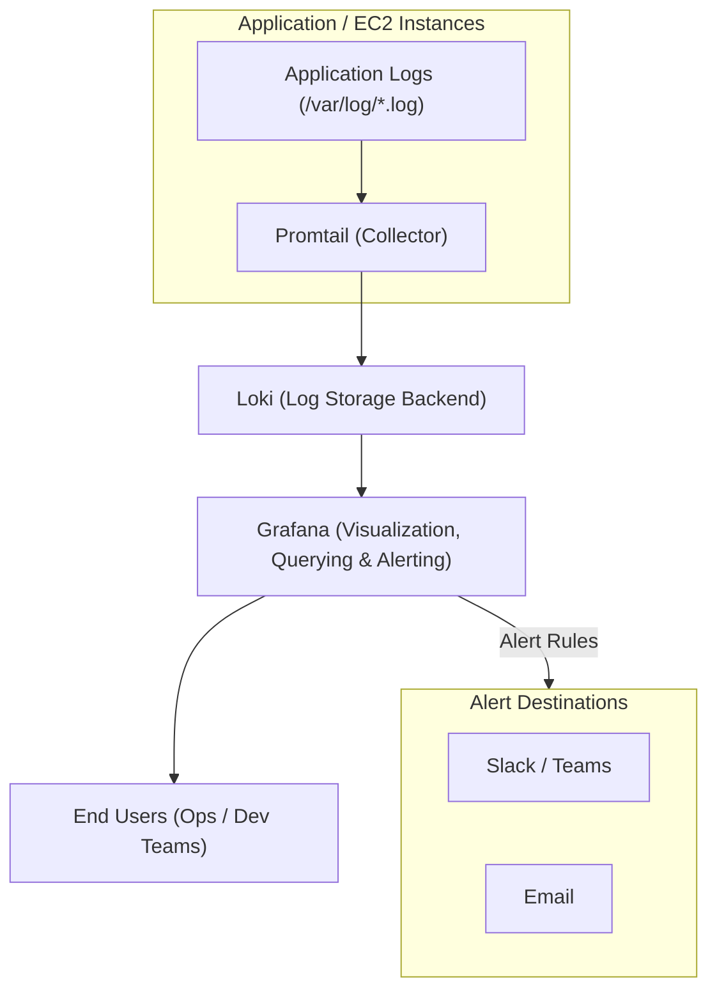

# **POC: Application Log Monitoring using Grafana Loki & Promtail**


##  Author Metadata

| Created by   | Created on | Version | Last Updated On | Pre Reviewer    | L0 Reviewer | L1 Reviewer   | L2 Reviewer  |
| ------------ | ---------- | ------- | --------------- | --------------- | ----------- | ------------- | ------------ |
| Divya-Mishra | 30-09-2025 | V1      | 08-10-2025      | Sahil/Siddharth | Ram-Ratan   | Gaurav-Singla | Mahesh-Kumar |

---

## **Table of Content**

* [Introduction](#introduction)
* [Objectives](#objectives)
* [Metrics to be Collected](#metrics-to-be-collected)
* [Architecture](#architecture)
* [Prerequisites](#prerequisites)
* [Implementation Steps](#implementation-steps)

  * [Setup Infrastructure](#setup-infrastructure)
  * [Install Loki (Log Backend)](#install-loki-log-backend)
  * [Install Promtail (Log Collector)](#install-promtail-log-collector)
  * [Install & Configure Grafana](#install--configure-grafana)
  * [Configure Alerts for Log Patterns](#configure-alerts-for-log-patterns)
* [Validation](#validation)
* [Sample Dashboards](#sample-dashboards)
* [Conclusion](#conclusion)
* [Contact Information](#contact-information)
* [References](#references)

---

## **1. Introduction**

This Proof of Concept (POC) demonstrates centralized **Application Log Monitoring** using **Grafana Loki** and **Promtail** — both visualized within a single Grafana setup.
Logs from multiple EC2 or application servers are collected using Promtail, stored in Loki, visualized in Grafana dashboards, and used to generate alerts for specific log patterns like “ERROR”, “FAILED”, or “EXCEPTION”.

---

## **2. Objectives**

* Collect application and system logs from multiple sources in real time.
* Store logs centrally using **Grafana Loki**.
* Visualize error trends and log flow using **Grafana Dashboards**.
* Configure **log-based alerts** directly from Grafana.

---

## **3. Metrics to be Collected**

The following log-based metrics are targeted:

| Metric              | Description                                              |
| ------------------- | -------------------------------------------------------- |
| **Error Count**     | Number of `ERROR` entries in logs over time              |
| **Warning Count**   | Number of `WARNING` or `EXCEPTION` logs                  |
| **Log Volume**      | Count of log lines ingested per instance                 |
| **Top Log Sources** | Most active hosts or applications generating logs        |
| **Error Frequency** | Frequency of failures or exceptions in last 5/10/15 mins |

---

## **4. Architecture**



---

## **5. Prerequisites**

| Component | Description                                                        |
| --------- | ------------------------------------------------------------------ |
| OS        | Ubuntu 22.04 / Amazon Linux 2                                      |
| Instances | 1 for Grafana + Loki, 1+ for Applications with Promtail            |
| Tools     | wget, unzip, systemctl, vim                                        |
| Ports     | 3000 (Grafana), 3100 (Loki), 9080 (Promtail)                       |
| Logs      | Application logs stored under `/var/log/*.log` or `/opt/app/logs/` |

---

## **6. Implementation Steps**

### **Step 1: Setup Infrastructure**

1. Launch EC2 Instances

   * **Monitoring Server:** Grafana + Loki
   * **Application Server:** Promtail
2. Update Security Groups

   * Grafana: allow inbound **3000, 3100**
   * Promtail: outbound access to **3100**
   * SSH (22) open for both

---

### **Step 2: Install Loki (Log Backend)**

```bash
sudo apt update -y
sudo apt install wget unzip -y

wget https://github.com/grafana/loki/releases/download/v2.9.2/loki-linux-amd64.zip
unzip loki-linux-amd64.zip
chmod +x loki-linux-amd64
sudo mv loki-linux-amd64 /usr/local/bin/loki
```

**Create Loki Config File**

```bash
sudo mkdir /etc/loki
sudo vim /etc/loki/config.yml
```

Paste:

```yaml
auth_enabled: false
server:
  http_listen_port: 3100

ingester:
  lifecycler:
    ring:
      kvstore:
        store: inmemory
      replication_factor: 1

schema_config:
  configs:
    - from: 2024-01-01
      store: boltdb-shipper
      object_store: filesystem
      schema: v12
      index:
        prefix: index_
        period: 24h

storage_config:
  boltdb_shipper:
    active_index_directory: /tmp/loki/index
    cache_location: /tmp/loki/cache
  filesystem:
    directory: /tmp/loki/chunks
```

**Run Loki**

```bash
nohup loki --config.file=/etc/loki/config.yml &
```

**Verify**

```
http://<grafana-server-ip>:3100/metrics
```

---

### **Step 3: Install Promtail (Log Collector)**

```bash
sudo apt update -y
sudo apt install wget unzip -y

wget https://github.com/grafana/loki/releases/download/v2.9.2/promtail-linux-amd64.zip
unzip promtail-linux-amd64.zip
chmod +x promtail-linux-amd64
sudo mv promtail-linux-amd64 /usr/local/bin/promtail
```

**Create Promtail Config**

```bash
sudo mkdir /etc/promtail
sudo vim /etc/promtail/config.yml
```

Paste:

```yaml
server:
  http_listen_port: 9080

positions:
  filename: /tmp/positions.yaml

clients:
  - url: http://<grafana-server-ip>:3100/loki/api/v1/push

scrape_configs:
  - job_name: system-logs
    static_configs:
      - targets:
          - localhost
        labels:
          job: varlogs
          host: ${HOSTNAME}
          __path__: /var/log/*.log
```

**Run Promtail**

```bash
nohup promtail --config.file=/etc/promtail/config.yml &
```

**Verify**

```
http://<app-server-ip>:9080/targets
```

→ “Targets Active” means Promtail is sending logs 

---

### **Step 4: Install & Configure Grafana**

```bash
sudo apt-get install -y adduser libfontconfig1
wget https://dl.grafana.com/oss/release/grafana_10.2.3_amd64.deb
sudo dpkg -i grafana_10.2.3_amd64.deb
sudo systemctl start grafana-server
sudo systemctl enable grafana-server
```

Access Grafana:
`http://<grafana-server-ip>:3000`
Login → **admin/admin**

**Add Loki Data Source**

1. Go to **Connections → Data Sources → Add Data Source → Loki**
2. URL: `http://localhost:3100`
3. Click **Save & Test**

**Explore Logs**

* Navigate to **Explore → Data Source: Loki**
* Query example:

  ```
  {job="varlogs"}
  ```
* Filter specific logs:

  ```
  {job="varlogs"} |= "ERROR"
  ```

---

### **Step 5: Configure Alerts for Log Patterns**

In Grafana:

1. Go to **Alerting → Alert Rules → New Alert Rule**
2. Query:

   ```
   count_over_time({job="varlogs"} |= "ERROR" [5m])
   ```
3. Condition:
   Trigger alert if count > 10 in last 5 minutes
4. Add notification channel (Slack / Email)
5. Save rule

**Test Alert**

```bash
for i in {1..20}; do echo "ERROR: test failure" >> /var/log/app.log; done
```

→ Grafana triggers “High Error Rate” alert.

---

## **7. Validation**

| Validation Item    | How to Check                                     | Expected Result           |                   |
| ------------------ | ------------------------------------------------ | ------------------------- | ----------------- |
| **Log Collection** | Grafana → Explore → Loki query `{job="varlogs"}` | Logs visible              |                   |
| **Error Filter**   | `{job="varlogs"}                                 | = "ERROR"`                | Error logs listed |
| **Dashboard**      | Import ID 15141                                  | Log volume & error panels |                   |
| **Alert Trigger**  | Create error logs                                | Alert visible in Grafana  |                   |

---

## **8. Sample Dashboards**

**Grafana Loki Overview Dashboard**


---

## **9. Conclusion**

This POC validates centralized log monitoring using **Grafana Loki** and **Promtail**, visualized entirely through **Grafana**.
It demonstrates:

* Real-time log collection
* Searchable centralized logging
* Log-based dashboards
* Alerting on log anomalies

This setup is perfect for **development or test environments**.
For production, enable **S3-based storage**, **authentication**, and **multi-tenant Loki clusters**.

---

## 14. Contact Information

| Name         | Email                                                                             |
| ------------ | --------------------------------------------------------------------------------- |
| Divya Mishra | [divya.mishra.snaatak@mygurukulam.co](mailto:divya.mishra.snaatak@mygurukulam.co) |---

## **11. References**

| Reference                                                                                   | Description                 |
| ------------------------------------------------------------------------------------------- | --------------------------- |
| [Grafana Loki Documentation](https://grafana.com/docs/loki/latest/)                         | Loki setup & architecture   |
| [Promtail Documentation](https://grafana.com/docs/loki/latest/clients/promtail/)            | Log collector setup         |
| [Grafana Alerting Documentation](https://grafana.com/docs/grafana/latest/alerting/)         | Alert configuration         |
| [Loki Dashboard ID 15141](https://grafana.com/grafana/dashboards/15141-loki-logs-overview/) | Loki log overview dashboard |

