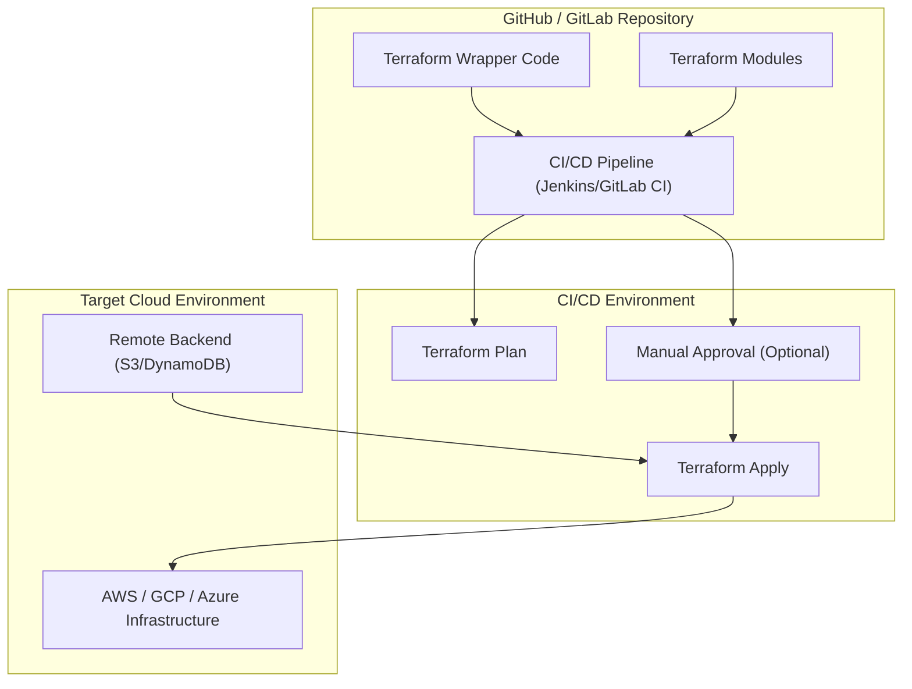

# **POC: Terraform Wrapper CI/CD Automation**

##  Author Metadata

| Created by   | Created on | Version | Last Updated On | Pre Reviewer    | L0 Reviewer | L1 Reviewer   | L2 Reviewer  |
| ------------ | ---------- | ------- | --------------- | --------------- | ----------- | ------------- | ------------ |
| Divya-Mishra | 30-09-2025 | V1      | 08-10-2025      | Sahil/Siddharth | Ram-Ratan   | Gaurav-Singla | Mahesh-Kumar |


---

## **Table of Content**

* [Introduction](#introduction)

* [Objectives](#objectives)

* [Architecture](#architecture)

* [Prerequisites](#prerequisites)

* [Implementation Steps](#implementation-steps)

  * [Setup Repository & Wrapper Code](#setup-repository--wrapper-code)
  * [Configure Terraform Backend](#configure-terraform-backend)
  * [Pipeline Creation (CI/CD)](#pipeline-creation-cicd)
  * [Approval & Manual Intervention](#approval--manual-intervention)
  * [Deploy Infrastructure](#deploy-infrastructure)

* [Validation](#validation)

* [Conclusion](#conclusion)

* [Contact Information](#contact-information)

* [References](#references)

---

## **1. Introduction**

This POC demonstrates automated **Terraform deployments** using a **wrapper code** approach in a **CI/CD pipeline**.
It includes:

* **Centralized state management** (remote backend)
* **Controlled execution** of `terraform plan` and `terraform apply`
* Optional **manual approvals** before production apply
* Logging and reporting of applied infrastructure changes

The wrapper code ensures **safe, repeatable, and auditable Terraform deployments**.

---

## **2. Objectives**

* Demonstrate **automated Terraform deployments** in a CI/CD pipeline
* Enable **remote state management** using S3 + DynamoDB (locking)
* Allow **controlled `apply`** with optional approval stages
* Show **practical commands & scripts** for wrapper usage
* Validate **successful infrastructure creation**

---

## **3. Architecture**



---

## **4. Prerequisites**

| Component       | Description                                                 |
| --------------- | ----------------------------------------------------------- |
| OS              | Ubuntu 22.04 / Amazon Linux 2                               |
| Tools           | Terraform 1.6+, AWS CLI / GCP CLI / Azure CLI, Git          |
| CI/CD Tool      | Jenkins / GitLab CI / GitHub Actions                        |
| Cloud Account   | AWS / GCP / Azure with IAM user for Terraform               |
| Repository      | Git repo containing **Terraform Modules + Wrapper Scripts** |
| Backend Storage | S3 bucket + DynamoDB table (for Terraform state & locks)    |

---

## **5. Implementation Steps**

### **Step 1: Setup Repository & Wrapper Code**

1. Create repo structure:

```
terraform-wrapper-ci/
│
├─ modules/
│   └─ vpc/
│       ├─ main.tf
│       ├─ variables.tf
│       └─ outputs.tf
│
├─ envs/
│   ├─ dev/
│   │   ├─ main.tf
│   │   └─ backend.tf
│   └─ prod/
│       ├─ main.tf
│       └─ backend.tf
│
└─ wrapper/
    └─ deploy.sh
```

2. Sample **wrapper script (`deploy.sh`)**:

```bash
#!/bin/bash
set -e

ENV=$1
ACTION=$2

if [[ -z "$ENV" || -z "$ACTION" ]]; then
  echo "Usage: ./deploy.sh <env> <plan|apply>"
  exit 1
fi

cd ../envs/$ENV

# Initialize Terraform
terraform init -backend-config="backend.tfvars"

# Plan or Apply
if [[ "$ACTION" == "plan" ]]; then
  terraform plan -out=tfplan
elif [[ "$ACTION" == "apply" ]]; then
  terraform apply "tfplan"
else
  echo "Invalid action. Use plan or apply"
  exit 1
fi
```

---

### **Step 2: Configure Terraform Backend**

**backend.tfvars**:

```hcl
bucket         = "terraform-state-bucket"
key            = "envs/dev/terraform.tfstate"
region         = "ap-south-1"
dynamodb_table = "terraform-locks"
encrypt        = true
```

**Terraform Backend Configuration (`backend.tf`)**:

```hcl
terraform {
  backend "s3" {
    bucket         = "terraform-state-bucket"
    key            = "envs/dev/terraform.tfstate"
    region         = "ap-south-1"
    dynamodb_table = "terraform-locks"
    encrypt        = true
  }
}
```

---

### **Step 3: Pipeline Creation (CI/CD)**

1. **Jenkins Pipeline Example** (`Jenkinsfile`):

```groovy
pipeline {
    agent any
    stages {
        stage('Checkout') {
            steps {
                git branch: 'main', url: 'https://github.com/sonalsinghroha/terraform-wrapper-ci.git'
            }
        }
        stage('Terraform Plan') {
            steps {
                sh 'bash wrapper/deploy.sh dev plan'
            }
        }
        stage('Approval') {
            when {
                branch 'main'
            }
            steps {
                input message: 'Approve Terraform Apply for PROD?', ok: 'Yes'
            }
        }
        stage('Terraform Apply') {
            steps {
                sh 'bash wrapper/deploy.sh dev apply'
            }
        }
    }
}
```

2. **Key Points**:

* CI runs `plan` first
* Optional `input` step for **manual approval**
* `apply` only after approval

---

### **Step 4: Approval & Manual Intervention**

* Manual approval ensures **sensitive infra is not applied automatically**
* Jenkins `input` stage pauses pipeline until user confirms
* Useful for production environments

---

### **Step 5: Deploy Infrastructure**

```bash
# Plan for DEV
cd envs/dev
../wrapper/deploy.sh dev plan

# Apply after review
../wrapper/deploy.sh dev apply
```

* Terraform state stored remotely
* Changes logged and auditable

---

## **6. Validation**

| Validation Item        | How to Check                         | Expected Result                |
| ---------------------- | ------------------------------------ | ------------------------------ |
| **Terraform Init**     | `terraform init`                     | Initialization successful ✅    |
| **Terraform Plan**     | `terraform plan -out=tfplan`         | Shows planned changes          |
| **Apply**              | `terraform apply tfplan`             | Infrastructure created         |
| **Remote State**       | Check S3 + DynamoDB                  | State file exists, locks work  |
| **Approval Stage**     | Jenkins input step                   | Pipeline pauses until approval |
| **Module Reusability** | Use wrapper in multiple environments | Works for dev/prod/test        |

---

## **7. Conclusion**

This POC demonstrates **automated Terraform deployments** using a **wrapper script** in a CI/CD pipeline:

* Ensures **controlled deployments**
* Supports **remote state management & locking**
* Allows **manual approvals** for production
* Provides **reusable wrapper code** across environments

This structure is suitable for **dev/test/prod pipelines** and can scale to **multi-team enterprise environments**.

---

## 14. Contact Information

| Name         | Email                                                                             |
| ------------ | --------------------------------------------------------------------------------- |
| Divya Mishra | [divya.mishra.snaatak@mygurukulam.co](mailto:divya.mishra.snaatak@mygurukulam.co) |

---

## **9. References**

| Reference                                                                                  | Description                  |
| ------------------------------------------------------------------------------------------ | ---------------------------- |
| [Terraform Documentation](https://developer.hashicorp.com/terraform/docs)                  | Official Terraform docs      |
| [Jenkins Pipeline Syntax](https://www.jenkins.io/doc/book/pipeline/syntax/)                | CI/CD pipeline examples      |
| [S3 Backend Docs](https://developer.hashicorp.com/terraform/language/settings/backends/s3) | Remote backend configuration |

